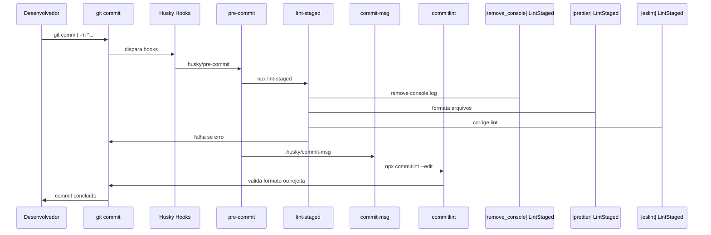

# Documentação do Projeto Nivance

Este documento descreve a configuração inicial do projeto Nivance, um aplicativo React Native com Expo, incluindo o ecossistema de qualidade de código: automação Husky com Git, padronização de commits, ESLint, Prettier e lint-staged.

---

## 1. Automação Husky com Git

O [Husky](https://typicode.github.io/husky/) permite executar scripts automaticamente em momentos específicos do fluxo Git, como antes de um commit ou ao validar a mensagem. Isso garante que todos os desenvolvedores sigam as mesmas regras sem precisar lembrar manualmente.

### Como funciona

Ao executar `git commit`, o Husky dispara os hooks configurados na pasta `.husky/`. Se qualquer hook falhar, o commit é **bloqueado** até que os problemas sejam corrigidos.

Fluxo completo:



### Instalação automática dos hooks

O script `prepare` no `package.json` executa o comando `husky` automaticamente após `npm install`. Assim, toda pessoa que clonar o repositório e instalar as dependências terá os hooks configurados sem passos adicionais.

### Hooks configurados

| Hook | Arquivo | O que faz |
|------|---------|-----------|
| **pre-commit** | `.husky/pre-commit` | Executa `npx lint-staged` nos arquivos em staging. Remove `console.log`, formata com Prettier e corrige com ESLint. Se algo falhar, o commit é bloqueado. |
| **commit-msg** | `.husky/commit-msg` | Executa `npx commitlint --edit $1` para validar a mensagem de commit conforme o padrão Conventional Commits. Mensagens fora do padrão impedem o commit. |

### O que acontece em caso de falha

- **pre-commit**: Se `lint-staged` retornar erro (ex.: ESLint com problemas não corrigíveis automaticamente), o commit é abortado. É necessário corrigir os arquivos e tentar novamente.
- **commit-msg**: Se a mensagem não seguir o formato exigido, o commit é rejeitado. Use `npm run commit` para um fluxo guiado ou ajuste a mensagem manualmente.

### Commit interativo com Commitizen

Em vez de `git commit -m "..."`, use:

```bash
npm run commit
```

Isso abre um assistente interativo (Commitizen + cz-conventional-changelog) que orienta a escolha do tipo, escopo e descrição da mensagem, garantindo compatibilidade com o Commitlint.

---

## 2. Padrão de commits (Conventional Commits)

As mensagens de commit seguem o padrão [Conventional Commits](https://www.conventionalcommits.org/), validado pelo Commitlint com `@commitlint/config-conventional`.

### Formato

```
tipo(escopo opcional): descrição
```

Exemplo: `feat(auth): adiciona login com Google`

### Tipos suportados

Para a lista completa com exemplos e detalhes, consulte o arquivo [COMMITS.MD](COMMITS.MD).

| Tipo | Descrição |
|------|-----------|
| `feat` | Nova funcionalidade |
| `fix` | Correção de bug |
| `refactor` | Refatoração sem mudar funcionalidade |
| `perf` | Melhoria de desempenho |
| `style` | Formatação (espaços, aspas, etc.) |
| `test` | Testes |
| `docs` | Documentação |
| `build` | Build ou dependências |
| `ci` | CI/CD |
| `chore` | Tarefas de manutenção |
| `env` | Variáveis e configs de ambiente |

---

## 3. Padrão de código (ESLint + Prettier)

### ESLint

O projeto usa ESLint 9 com configuração flat em [eslint.config.js](eslint.config.js).

- **Plugins**: TypeScript, React
- **Regras principais**:
  - `no-unused-vars`: warning
  - `@typescript-eslint/no-explicit-any`: error
  - `@typescript-eslint/explicit-module-boundary-types`: error
  - `react/react-in-jsx-scope`: off
  - `react/prop-types`: off

Arquivos como `eslint.config.js`, `metro.config.js` e `remove_console*.js` têm a regra `@typescript-eslint/no-require-imports` desabilitada para permitir `require()`.

### Prettier

Configuração em [.prettierrc](.prettierrc):

| Opção | Valor |
|-------|-------|
| `useTabs` | true |
| `tabWidth` | 4 |
| `singleQuote` | true |
| `jsxSingleQuote` | true |
| `semi` | true |
| `printWidth` | 100 |
| `trailingComma` | all |
| `endOfLine` | lf |
| `arrowParens` | always |
| `bracketSpacing` | true |
| `bracketSameLine` | true |

### lint-staged

O lint-staged é executado no hook pre-commit sobre os arquivos em staging. A configuração está no `package.json`:

**Arquivos**: `*.{js,jsx,ts,tsx}`

**Pipeline** (nessa ordem):

1. `node remove_console.js` – Remove instruções `console.log` dos arquivos
2. `prettier --write` – Formata o código
3. `eslint --fix` – Corrige problemas que o ESLint consegue resolver automaticamente

O script [remove_console.js](remove_console.js) é um utilitário customizado que remove ocorrências de `console.log` dos arquivos antes do commit.

---

## 4. Scripts do package.json

| Script | Comando | Uso |
|--------|---------|-----|
| `start` | `expo start --dev-client` | Inicia o app em modo desenvolvimento |
| `android` | `expo run:android` | Executa no emulador/dispositivo Android |
| `ios` | `expo run:ios` | Executa no simulador/dispositivo iOS |
| `web` | `expo start --web` | Inicia a versão web |
| `prepare` | `husky` | Executado automaticamente no `npm install` para configurar os hooks Git |
| `commitlint` | `commitlint` | Valida mensagens de commit manualmente (útil em CI ou debug) |
| `commit` | `git-cz` | Commit interativo com Conventional Commits (Commitizen) |

### Como utilizar

- **Desenvolvimento**: `npm start`, `npm run android`, `npm run ios` ou `npm run web`
- **Commits**: Prefira `npm run commit` para o fluxo guiado, ou use `git commit` com mensagens no padrão Conventional Commits
- **Validação manual**: `npx commitlint` (para validar mensagem), `npx eslint .` (para lint), `npx prettier --write .` (para formatação)
- **Após clonar o repositório**: executar `npm install` já configura o Husky; não é necessário rodar nada extra

---

## 5. Fluxo recomendado para commits

1. Editar o código
2. Adicionar arquivos ao staging: `git add .` (ou arquivos específicos)
3. Fazer o commit:
   - **Recomendado**: `npm run commit` (fluxo interativo)
   - **Alternativa**: `git commit -m "tipo(escopo): descrição"`
4. Os hooks do Husky rodam automaticamente:
   - Se houver erro, corrigir e repetir o `git add` e o commit
   - Se tudo passar, o commit é concluído com sucesso
